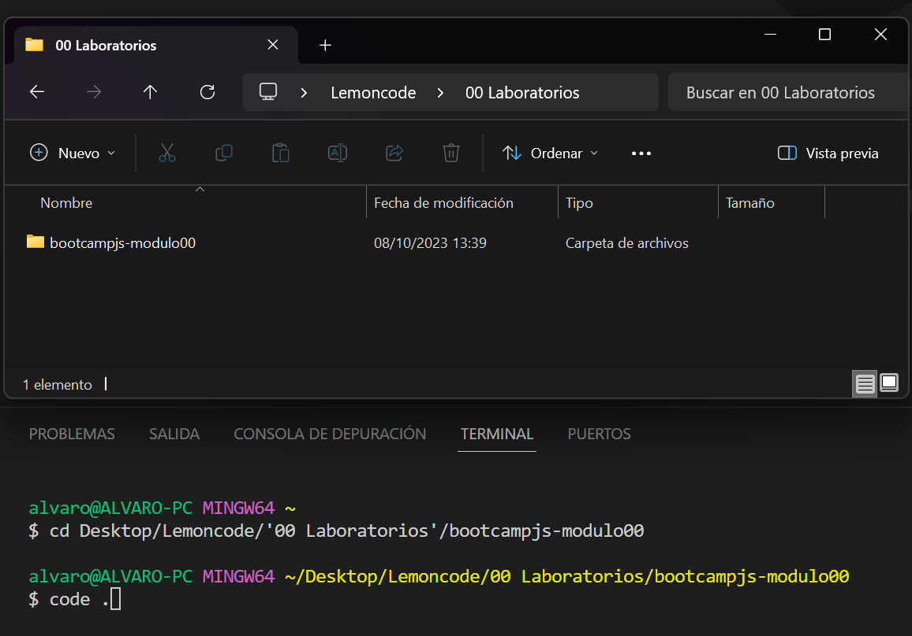
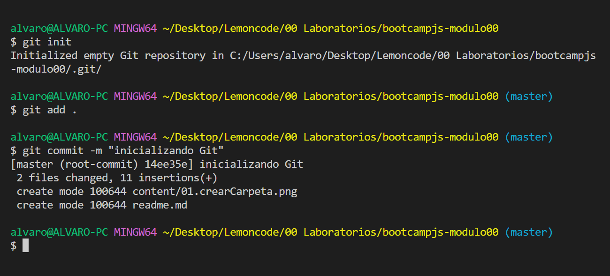
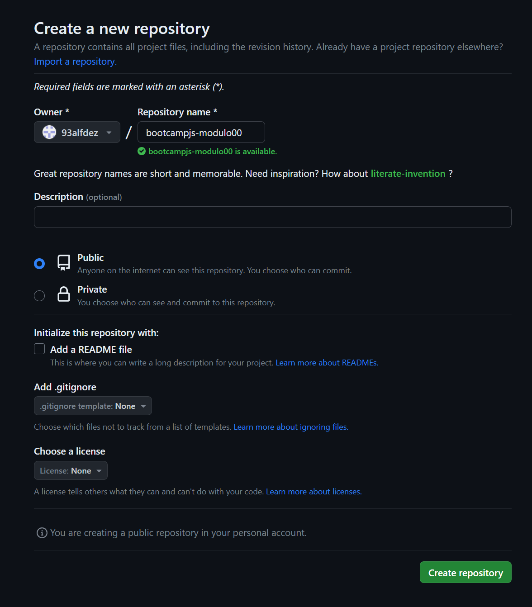

# 1. Crear un repositorio en local

Creo la carpeta _bootcampjs-modulo00_ en el directorio donde quiero tenerlo.

Ingreso en la carpeta a través del terminal y abro con el comando _code ._ la carpeta en VSCode.

Una vez abierto en code, inicializamos el repositorio de Git.

# 2. Subir el repositorio a Github

Creo un nuevo repositorio en GitHub que se llama _bootcampjs-modulo00_

