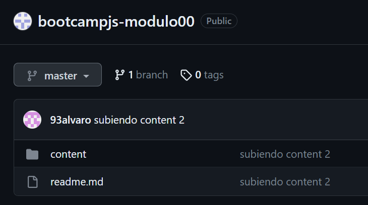

# 1. Crear un repositorio en local

Creo la carpeta _bootcampjs-modulo00_ en el directorio donde quiero tenerlo.

Ingreso en la carpeta a través del terminal y abro con el comando _code ._ la carpeta en VSCode.

Una vez abierto en code, inicializamos el repositorio de Git.

# 2. Subir el repositorio a Github

Creo un nuevo repositorio en GitHub que se llama _bootcampjs-modulo00_

Con el comando _git remote add origin git@github.com:93alfdez/bootcampjs-modulo00.git_ lo conecto con GitHub

Posteriormente subo la rama _master_ con _git push -u origin master_

Refresco en GitHub y veo que la rama _master_ se ha creado sin problema y que los directorios se han conectado.

# 3. Hacer un commit y un push
