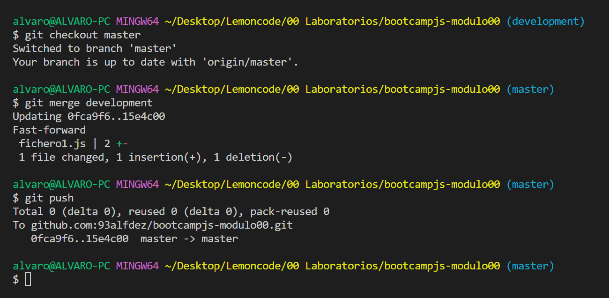

# 1. Crear un repositorio en local

Creo la carpeta _bootcampjs-modulo00_ en el directorio donde quiero tenerlo.

Ingreso en la carpeta a través del terminal y abro con el comando _code ._ la carpeta en VSCode.

Una vez abierto en code, inicializamos el repositorio de Git.

# 2. Subir el repositorio a Github

Creo un nuevo repositorio en GitHub que se llama _bootcampjs-modulo00_

Con el comando _git remote add origin git@github.com:93alfdez/bootcampjs-modulo00.git_ lo conecto con GitHub

Posteriormente subo la rama _master_ con _git push -u origin master_

Refresco en GitHub y veo que la rama _master_ se ha creado sin problema y que los directorios se han conectado.

# 3. Hacer un commit y un push

Creo el archivo _fichero1.js_ en el directorio

Lo añado a staging con _git add ._

Creo el commit con el comando _git commit -m_ _"subiendo fichero1"_

Con _git push_ subo los cambios al repo de GitHub.

# 4. Crear una rama

Con el comando _git branch development_ creo la nueva rama.

Cambio de rama con _git checkout development_.

Hago cambios en el archivo _fichero1.js_ y añado un commit con el nombre _cambios fichero1_ en la rama _development_.

Hago un push a GitHub con el comando _git push --set-upstream origin development_ porque es nueva rama.

# 5. Hacer un merge

Vuelvo a la rama _master_ con _git checkout master_

Hago un merge de development con _git merge development_

En mi caso no hay conflictos, por tanto los cambios se incorporan sin problemas.

Hago un push para añadir los cambios al repo de GitHub

Con esto finalizo el primer laboratorio!

_PD1: He trabajado con master en vez de main al igual que las lecciones, espero que no haya problema._

_PD2: Verás algún commit de más por la subida del content y del readme._
